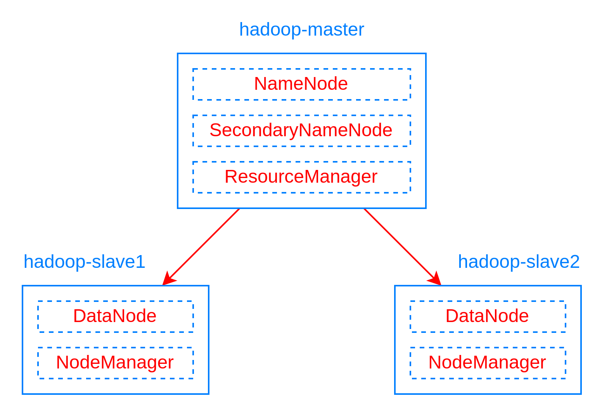

## Run Hadoop Cluster within Docker Containers
Based on [kiwenlau's repo](https://github.com/kiwenlau/hadoop-cluster-docker) to build with hadoop 3.2.4



### 3 Nodes Hadoop Cluster

##### 1. pull docker image

```
docker pull danchoi2001/hadoop:1.0
```

##### 2. clone github repository

```
git clone https://github.com/TianHuijun/hadoop-cluster-docker.git
```

##### 3. create hadoop network

```
docker network create --driver=bridge hadoop
```

##### 4. start container

```
cd hadoop-cluster-docker
bash ./start-container.sh
```

**output:**

```
start hadoop-master container...
start hadoop-slave1 container...
start hadoop-slave2 container...
root@hadoop-master:~# 
```
- start 3 containers with 1 master and 2 slaves
- you will get into the /root directory of hadoop-master container

##### 5. start hadoop

```
bash ./start-hadoop.sh
```

##### 6. run wordcount

```
bash ./run-wordcount.sh
```

**output**

```
input file1.txt:
Hello Hadoop

input file2.txt:
Hello Docker

wordcount output:
Docker    1
Hadoop    1
Hello    2
```

### Arbitrary size Hadoop cluster

##### 1. pull docker images and clone github repository

do 1~3 like section A

##### 2. rebuild docker image

```
bash ./resize-cluster.sh 5
```
- specify parameter > 1: 2, 3..
- this script just rebuild hadoop image with different **slaves** file, which pecifies the name of all slave nodes


##### 3. start container

```
bash ./start-container.sh 5
```
- use the same parameter as the step 2

##### 4. run hadoop cluster 

do 5~6 like section A

### An easier installation, no need to manually set the number of nodes like above
```
bash ./start-container.sh <number_of_nodes>
```

### Inspect

Run `docker network inspect` on the network (e.g. `hadoop`) to find the IP the hadoop interfaces are published on. Access these interfaces with the following URLs:

- Namenode: http://<dockerhadoop_IP_address>:9870/dfshealth.html#tab-overview
- Datanode: http://<dockerhadoop_IP_address>:9864/
- Nodemanager: http://<dockerhadoop_IP_address>:8042/node
- Resource manager: http://<dockerhadoop_IP_address>:8088/

### Additional references:
- Theory and setup:
  - https://www.linode.com/docs/guides/how-to-install-and-set-up-hadoop-cluster/
  - https://stackoverflow.com/a/48170409/18448121
  - https://viblo.asia/p/tim-hieu-ve-hadoop-hdfs-hadoop-mapreduce-ly-thuyet-5pPLkjNZJRZ
- Configs hadoop 3.2.4:
  - [core-default.xml](https://hadoop.apache.org/docs/r3.2.4/hadoop-project-dist/hadoop-common/core-default.xml)
  - [hdfs-default.xml](https://hadoop.apache.org/docs/r3.2.4/hadoop-project-dist/hadoop-hdfs/hdfs-default.xml)
  - [mapred-default.xml](https://hadoop.apache.org/docs/r3.2.4/hadoop-mapreduce-client/hadoop-mapreduce-client-core/mapred-default.xml)
  - [yarn-default.xml](https://hadoop.apache.org/docs/r3.2.4/hadoop-yarn/hadoop-yarn-common/yarn-default.xml)
- Sources:
  - https://github.com/big-data-europe/docker-hadoop (if you are using this repo, you can encounter `Namenode is in safe mode`, solved [here](https://github.com/big-data-europe/docker-hadoop/issues/81#issuecomment-1111542358))
